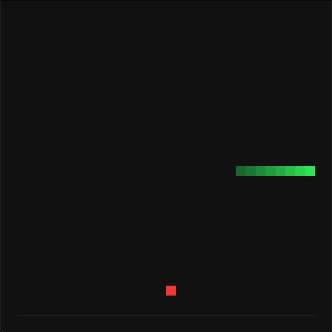

#  Snake Game

A simple window-based Snake game implemented in C using SDL library.

## Description

This Snake game is written in C and utilizes the SDL library for rendering. It allows players to control a snake, guiding it to eat apples and grow longer while avoiding collisions with itself and the walls.

| Key | Action |
| --- | ------ |
| `W` or `Up Arrow` | Move up |
| `A` or `Left Arrow` | Move left |
| `S` or `Down Arrow` | Move down |
| `D` or `Right Arrow` | Move right |
| `ESC` | Quit the game |
| `0` | Turn off auto mode |
| `1` | Turn on auto mode `1`|
| `2` | Turn on auto mode `2`|

## Dependencies

- [SDL2 library](https://www.libsdl.org)
